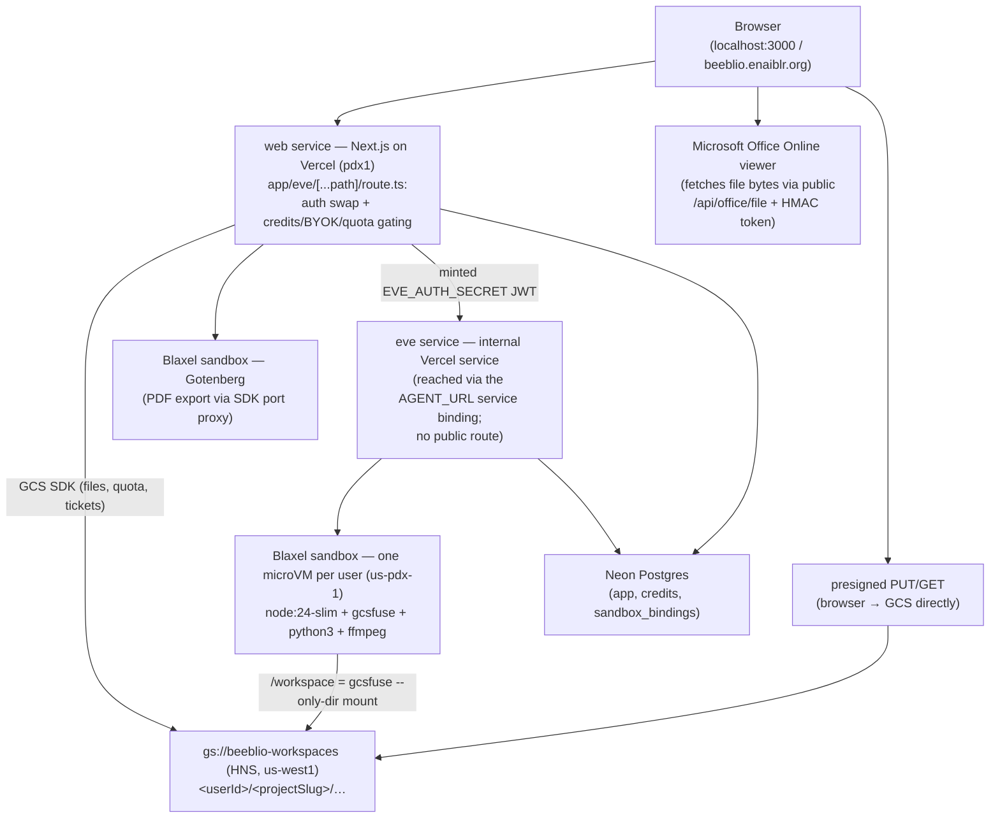

# beeblio

An AI research workspace: an [eve](https://eve.dev) agent co-edits files with
users inside a [Blaxel](https://blaxel.ai) microVM sandbox, with durable files
in GCS, a Next.js UI, credits/BYOK billing, and Office document services —
deployed as a single Vercel project.

The agent runs real shell commands, scripts, and file operations inside a
per-project Linux sandbox whose `/workspace` is a gcsfuse mount of the
project's prefix in the workspace bucket. The web UI streams the agent's
reasoning, tool calls, and replies in real time.

Architecture history and rationale (agentOS → Blaxel/GCS migration, Phase 0
spike results, fallback ladders): [docs/plans/blaxel-sandbox-migration.md](./docs/plans/blaxel-sandbox-migration.md).

---

## Stack

| Layer         | Technology                                                                                        |
| ------------- | ------------------------------------------------------------------------------------------------- |
| Agent frame   | [eve](https://eve.dev) `0.27.x` (durable agents as files)                                          |
| Sandbox       | [Blaxel](https://blaxel.ai) microVM, `us-pdx-1`, custom image (`node:24-slim` + gcsfuse + python3 + ffmpeg) |
| Storage       | GCS bucket `gs://beeblio-workspaces` (Hierarchical Namespace, `us-west1`) — source of truth       |
| UI + agent    | One Vercel project: `web` service (Next.js `16` App Router + React `19`) and an internal `eve` service, region `pdx1` |
| Model         | OpenRouter direct (`OPENROUTER_MODEL_ID`), with per-session BYOK override from the user's own key  |
| Auth          | Neon Auth (Google) for the app UI; a shared-secret JWT (`EVE_AUTH_SECRET`) gates the eve channel   |
| Database      | Neon Postgres via [Drizzle ORM](https://orm.drizzle.team) (app schema, credits, sandbox bindings)  |
| Office docs   | Microsoft Office Online viewer (view-only previews) + Gotenberg in a Blaxel sandbox (PDF export)   |

---

## Architecture



Key properties:

- **One sandbox per user** (`bee-<hash(userId)>`), shared by every chat
  session, subagent, and project of that user; each session's paths are
  scoped to its project's `/workspace/<projectSlug>` directory. Blaxel
  standbys the microVM between turns (~1 s resume) and TTL-deletes it after
  idle; the next turn recreates it from the image and remounts via the
  `sandbox_bindings` row.
- **GCS is the source of truth.** The app reads/writes through the GCS SDK;
  the sandbox sees the same objects through the gcsfuse mount (tuned
  1–2 s metadata TTLs). Evicting or deleting a sandbox never loses data.
- **The agent has no public ingress.** All browser traffic enters through the
  Next.js proxy route, which authenticates the Neon Auth session, reserves
  credits, resolves BYOK model preferences, then forwards with a minted
  short-lived JWT.

---

## Prerequisites

- **Node.js 24.x** (see `engines` in `package.json`) and **pnpm**
- An **OpenRouter API key** (direct provider — not the Vercel AI Gateway)
- A **Neon Postgres** project with **Neon Auth** enabled
- A **GCP project** with the `beeblio-workspaces` HNS bucket and the
  `beeblio-sandbox` service account (see [Deployment](#deployment))
- A **Blaxel** workspace (`BL_WORKSPACE` / `BL_API_KEY`) — only needed for
  real sandbox turns

---

## Quick start

```bash
pnpm install
cp .env.example .env.local   # then fill it in (see below)
pnpm db:migrate              # apply Drizzle migrations to Neon
```

Everything runs from one `.env.local` (the eve process reads it too). The
minimum for UI + agent chat:

```bash
DATABASE_URL=…               # Neon pooled connection string
NEON_AUTH_BASE_URL=…         # from the Neon Console (Auth enabled)
NEON_AUTH_COOKIE_SECRET=…    # openssl rand -base64 32
OPENROUTER_API_KEY=…         # model access
OPENROUTER_MODEL_ID=…        # e.g. the main model you use
EVE_AUTH_SECRET=…            # openssl rand -base64 32 (shared with the channel)
BYOK_ENCRYPTION_KEY=…        # openssl rand -base64 32 (user OpenRouter keys at rest)
AGENT_URL=http://127.0.0.1:2000
```

Sandbox turns additionally need the Blaxel + GCS block from
`.env.example` (`BL_WORKSPACE`, `BL_API_KEY`, `GCS_BUCKET`, `GCS_SA_KEY_FILE`,
`BLAXEL_SANDBOX_IMAGE`, …). Build and push the sandbox image once with
`pnpm build:sandbox` and copy the emitted reference into
`BLAXEL_SANDBOX_IMAGE`. Local development uses the real GCS bucket and Blaxel
sandboxes — scope experiments to a throwaway project.

Local development runs **two** processes side by side:

```bash
# terminal 1: the eve agent backend on http://127.0.0.1:2000
pnpm dev:eve --no-ui        # omit --no-ui to also get the terminal TUI

# terminal 2: the Next.js UI on http://localhost:3000
pnpm dev
```

`AGENT_URL` in `.env.local` selects which agent the UI talks to (locally the
one above; on Vercel it is injected automatically by the eve service binding —
see [Deployment](#deployment)). Verify the agent with
`curl http://localhost:2000/eve/v1/health`, then open
<http://localhost:3000>, sign in, and open a project to chat.

> The `eve` CLI is a local dependency, not installed globally. Use the npm
> scripts (`pnpm dev:eve`, `pnpm build:eve`) or `pnpm exec eve <command>`. Do
> not run a bare `eve dev`. Do not run `eve link` / `eve deploy` in this repo —
> they run `vercel env pull`, which overwrites `.env.local` with the Vercel
> project's remote values and destroys local-only development variables.

## Billing

Paid plans, credit top-ups, and storage add-ons check out through Lemon Squeezy (global, USD) or Mayar (Indonesia, IDR), chosen from the visitor's location (`x-vercel-ip-country`) with a manual region switch on `/pricing`.

1. Copy the blank `LEMON_SQUEEZY_*` and `MAYAR_*` variables from `.env.example` into `.env.local`.
2. Apply migration `0008` (`pnpm db:migrate`) so `app.credit_products` and the payment tables exist.
3. Replace the placeholder Lemon Squeezy `provider_price_id` values (`ls-test:*` or `ls-live:*`) with real variant IDs. Mayar products are amount-based and keep synthetic ids such as `plan:plus`.
4. Point Lemon Squeezy webhooks at `/api/billing/webhooks/lemonsqueezy` and Mayar webhooks at `/api/billing/webhooks/mayar/<MAYAR_WEBHOOK_TOKEN>`.

---

## Scripts

| Script             | Command                        | What it does                                        |
| ------------------ | ------------------------------ | --------------------------------------------------- |
| `pnpm dev`         | `next dev`                     | Next.js UI at `:3000`; proxies agent traffic to `AGENT_URL` |
| `pnpm build`       | `next build`                   | Production build of the Next.js app                 |
| `pnpm start`       | `next start`                   | Run the production build                            |
| `pnpm typecheck`   | `tsc --noEmit`                 | Type-check the project                              |
| `pnpm dev:eve`     | `eve dev`                      | eve agent backend on `127.0.0.1:2000` + TUI         |
| `pnpm build:eve`   | `eve build`                    | Build the eve agent artifacts                       |
| `pnpm start:eve`   | `eve start`                    | Start the built eve agent                           |
| `pnpm build:sandbox` | `node scripts/build-sandbox-image.mjs` | Build + push the Blaxel sandbox image; prints the reference for `BLAXEL_SANDBOX_IMAGE` |
| `pnpm db:generate` | `drizzle-kit generate`         | Create a migration from `db/schema.ts`              |
| `pnpm db:push`     | `drizzle-kit push`             | Push schema changes straight to the DB              |
| `pnpm db:migrate`  | `drizzle-kit migrate`          | Apply pending migrations to the DB                  |
| `pnpm db:studio`   | `drizzle-kit studio`           | Open Drizzle Studio to browse the DB                |

---

## Project layout

```text
beeblio/
├── agent/                    # the eve agent (filesystem-first)
│   ├── agent.ts              # model + build options (externals incl. @napi-rs/canvas)
│   ├── instructions.md       # agent identity and behavior (system prompt)
│   ├── proxy-auth.ts         # channel auth: verifies the minted app JWT
│   ├── channels/             # eve.ts (HTTP channel) + skills.ts (skills API)
│   ├── hooks/credits.ts      # reservation attribution + per-step usage metering
│   ├── sandbox/
│   │   ├── sandbox.ts        # defineSandbox over the Blaxel backend + onSession binding
│   │   ├── blaxel-backend.ts # eve SandboxBackend: create/attach, mount, exec, eviction
│   │   └── image/            # Dockerfile, gcsfuse mount script, agent-libs manifest
│   ├── tools/                # bash, read/write_file, literature/PDF/office/media tools…
│   ├── skills/               # static skills shipped to every user
│   ├── lib/                  # agent-side utilities (credit metering, quota, sweep…)
│   ├── workspace-paths.ts    # identity + path validation helpers
│   └── workspace-files.ts    # historical import path → lib/workspace-gcs.ts
├── app/                      # Next.js App Router UI
│   ├── [projectId]/[[...sessionId]]/page.tsx # project chat + file explorer
│   ├── eve/[...path]/route.ts # authenticated /eve proxy to AGENT_URL
│   └── api/workspace/upload-ticket/route.ts  # presigned browser→GCS uploads
├── lib/
│   ├── workspace-gcs.ts      # shared GCS operations (app + agent)
│   ├── workspace-upload.ts   # client: ticket fetch + direct PUT
│   ├── skills-storage.ts     # client of the agent skills channel
│   └── credits/, entitlements/, auth/, …
├── db/ + drizzle/            # Drizzle schema, client, committed migrations
├── vercel.json               # Vercel Services: web + eve, AGENT_URL binding
├── spike/                    # Phase 0/1 verification scripts (throwaway GCS prefix)
└── .eve/                     # gitignored: dev runtime, logs, snapshots
```

---

## The agent (eve)

eve is filesystem-first: a file's location defines its role. Add capabilities
by creating the conventional folders under `agent/`:

| Path              | Purpose                                               |
| ---------------- | ----------------------------------------------------- |
| `instructions.md` | Always-on system prompt (identity, rules)             |
| `agent.ts`        | Model and runtime options                             |
| `tools/*.ts`      | Typed functions the model can call (`defineTool`)     |
| `skills/*.md`     | Longer procedures loaded only when relevant           |
| `channels/*.ts`   | Delivery surfaces (HTTP, skills API, the eve TUI)     |
| `connections/`    | External MCP or OpenAPI tool services                 |
| `subagents/`      | Specialist agents the root agent delegates to         |
| `hooks/`          | Code reacting to lifecycle and stream events          |
| `lib/`            | Shared utilities                                      |

Built-in tools `bash`, `read_file`, `write_file`, `glob`, and `grep` target
the sandbox. Author a new tool with `defineTool` and a Zod schema:

```ts
import { defineTool } from "eve/tools";
import { z } from "zod";

export default defineTool({
  description: "Get the weather for a city.",
  inputSchema: z.object({ city: z.string() }),
  async execute({ city }) {
    return { city, condition: "Sunny" };
  },
});
```

The model is a direct OpenRouter `LanguageModelV2` (`@openrouter/ai-sdk-provider`)
so requests go straight to OpenRouter with `OPENROUTER_API_KEY` — a plain
gateway-id string would revert to the Vercel AI Gateway. Sessions may override
the model per turn with a BYOK key (resolved in the proxy from the project's
preference, decrypted agent-side; BYOK turns never fall back to the system
key — they fail closed).

`build.externalDependencies` in `agent/agent.ts` keeps native/SDK packages out
of the bundle so Vercel installs them into the eve function:
`@blaxel/core`, `@google-cloud/storage`, and `@napi-rs/canvas` (pdfjs needs
the last one for `DOMMatrix`/`ImageData`/`Path2D`; without it the service
crashes on boot).

---

## The sandbox (Blaxel)

`agent/sandbox/` implements eve's `SandboxBackend` over Blaxel microVMs.

- **Image** (`agent/sandbox/image/`, built by `pnpm build:sandbox`):
  `node:24-slim` + pinned gcsfuse + fuse3 + python3/pip + ffmpeg + the pinned
  agent libraries baked under `/opt/agent-libs`. The Blaxel `sandbox-api`
  daemon is the workload; mounts happen at runtime over the process API (a
  custom `ENTRYPOINT` breaks sandbox startup).
- **Keying**: one sandbox per project — the name derives from
  `sha256(userId/projectSlug)`, so editing the sandbox definition or rotating
  session keys never mints a new microVM. eve creates sandboxes *pending*
  identity; `onSession` resolves the caller and points the session at the
  project sandbox (`sandbox_bindings` table in Neon + a
  `/workspace/.bee-workspace.json` marker that refuses rebinding).
- **Mount**: on attach, `ensureWorkspaceMounted` runs
  `gcsfuse --only-dir=<userId>/<projectSlug>` with tuned
  `--metadata-cache-ttl-secs=1` flags (the default 60 s stat TTL serves stale
  attributes after app-side writes and breaks co-editing), verifies the mount
  with kernel-side `timeout`-guarded I/O plus a nonce written through the GCS
  SDK, and self-heals wedged mounts (clear-then-mount, never stacked).
- **Exec**: detached named processes with `waitForCompletion: false`, polled
  via `process.get` (the SDK never fires streaming callbacks for detached
  execs — output is backfilled from `process.get().logs`); wall-clock capped
  by `BLAXEL_SANDBOX_EXEC_TIMEOUT_MS`.
- **Lifecycle**: standby seconds after disconnect (~1 s resume, processes and
  mount intact); `ttl-idle` deletes after `BLAXEL_SANDBOX_IDLE_TTL`; the
  backend evicts least-recently-used *idle* sandboxes when a create hits
  `BLAXEL_SANDBOX_MAX` (never one that is `RUNNING` or inside the grace
  window). Every API call is wrapped in a wake-retry (a resuming sandbox can
  502/504 on first touch) that treats file-level 404s as terminal.
- **Trust model (experimental)**: the guest holds bucket-wide GCS credentials
  (creation-time env), pinned by `--only-dir`. Dedicated bucket + scoped SA
  for now; per-user creds or a brokered mount before real multi-tenant
  production.

---

## Workspace storage (GCS)

`gs://beeblio-workspaces` (Hierarchical Namespace, `us-west1`) is the single
source of truth; `lib/workspace-gcs.ts` implements the operations used by both
the app and the agent:

| Need            | Mechanism                                                      |
| --------------- | -------------------------------------------------------------- |
| App-side CRUD   | GCS SDK (list prefix, GET/PUT, HNS rename, folder create/delete) |
| Browser upload  | `POST /api/workspace/upload-ticket` → size-constrained signed v4 POST policy (10 min TTL) → browser posts to GCS directly, bypassing Vercel's ~4.5 MB body cap |
| Browser download| app route authorizes the path, then redirects to a short-lived signed GCS GET; archives are produced in the existing Blaxel sandbox and downloaded from GCS |
| Freshness       | app writes are strongly consistent; the sandbox's gcsfuse mount sees them within its 1–2 s TTLs; turn-boundary reconciliation (`beeblio:workspace-changed`) covers the rest |
| ETag/Range      | native GCS `generation`/etag → 304 and byte-range media seeking |
| Quota           | plan storage quotas enforced on writes + a turn-gate backstop in the `/eve` proxy |

The bucket needs a **CORS policy** for browser-direct presigned requests
(origins: the production domain + localhost; methods GET/HEAD/POST; exposed
headers Content-Type/ETag/x-goog-*). It is already applied; verify with a
preflight curl (see [Deployment](#deployment)). Note that
`gcloud storage buckets describe` reports `cors: null` on HNS buckets even
when the policy is live — trust the preflight response.

---

## File management (UI ↔ agent)

The Workspace Files panel and the agent's `/workspace` are the same objects in
the same bucket prefix:

- UI list/read/write/rename/copy/move/delete and uploads go through
  authenticated server actions (`app/[projectId]/file-actions.ts`) →
  `lib/workspace-gcs.ts`; uploads use the presigned ticket flow above.
- The agent's `bash`/`read_file`/`write_file` run against the gcsfuse-mounted
  `/workspace` in the project's sandbox.
- The project slug reaches the sandbox through the auth context:
  `agent-chat.tsx` sends an `x-project-slug` header, the `/eve` proxy
  forwards it, and `agent/channels/eve.ts` stamps it onto
  `ctx.session.auth.current.attributes.projectSlug`. Scope is always bounded
  by the trusted `principalId` (the Neon Auth user id).

A file uploaded in the UI is visible to the agent at `/workspace/<file>` on
the next turn (within the mount TTL), and anything the agent writes appears in
the panel after the turn-end refresh event.

### In-app viewer

`app/[projectId]/_components/file-viewer.tsx` opens light files in the app:
markdown and Mermaid render through the same Streamdown pipeline as chat
messages; images render inline; text/code is editable and saves via `saveFile`.
Big/binary files (Office, PDF, multimedia) open in a new tab where the browser
views or downloads them.

---

## User-defined agent skills

Besides the static skills compiled into the agent (`agent/skills/*.md`, shared
by all users), every user can create their own from the **Skills** panel in
the project UI. A skill is a folder with a `SKILL.md` (frontmatter
`name`/`description` + markdown instructions) stored user-scoped at
`gs://<bucket>/<userId>/skills/<slug>/SKILL.md` — available in every project
and never colliding with one. GCS is the source of truth; there is no skills
table.

- **Editing:** structured form or raw markdown editor over the same file. The
  slug derives from the name (`apa-style`) and stays fixed.
- **Runtime:** `agent/skills/user.ts` is an eve dynamic resolver that runs on
  `turn.started`, reads the caller's skills prefix (scoped by the verified
  `principalId`), and returns each valid `SKILL.md` as a `defineSkill` — a
  skill created mid-session is live on the next message. Invalid files are
  flagged in the panel but never advertised.
- **Mentioning:** `/` in the composer opens a skill picker; selections ride
  the message's `<workspace_context>` block and the instructions tell the
  model to `load_skill` them.
- **API:** `agent/channels/skills.ts` exposes `GET/PUT/DELETE
  /skills/v1/skill?slug=…` and `GET /skills/v1/skills`, authenticated with the
  same minted agent JWT. Frontend path: `lib/skills-storage.ts` →
  `app/[projectId]/skill-actions.ts` → the panel.

---

## Verifying the sandbox

Open a chat and try these.

**Smoke test and binary audit** (the image ships more than the old agentOS VM
— python3 and ffmpeg are first-class now; git/curl are not installed):

```text
Run this in the sandbox and paste the complete output:
echo smoke=ok; for c in sh bash pwd ls cat uname whoami date env node python3 pip3 ffmpeg git curl; do command -v "$c" >/dev/null 2>&1 && echo "FOUND $c -> $(command -v $c)" || echo "MISSING $c"; done; echo "PWD=$(pwd)"
```

A real run prints `smoke=ok`, a FOUND/MISSING list, and `PWD=/workspace`.

**Real Python:** `python3 -c "import statistics; print(statistics.median([1,3,2]))"`.

**Durable files across turns:** write `/workspace/marker.txt`, then read it
back in a new message — the object persists in GCS even across sandbox
TTL-deletion and recreation.

**Co-editing:** upload `greeting.txt` in the Workspace Files panel, then ask
the agent to read `/workspace/greeting.txt`; have it write
`/workspace/agent-out.txt` and confirm the file appears in the panel after
the turn.

**Shared sandbox:** open two chats in the same project — one
`bee-*` sandbox appears in the Blaxel console, and both see each other's
file writes.

**Network** (no curl — use Node or python3):

```
Run: node -e "fetch('https://api.github.com/zen').then(r=>r.text()).then(console.log)"
```

---

## Configuration reference

### `agent/agent.ts`

Model + runtime options. Marks the native/SDK packages as external
(`@blaxel/core`, `@google-cloud/storage`, `@napi-rs/canvas`) so the Vercel
function installs them; pins the compaction context window; sets per-session
token limits.

### `agent/sandbox/sandbox.ts`

`defineSandbox({ backend: blaxelBackend(backendOptions), onSession })`. The
options block reads `BLAXEL_REGION`, `BLAXEL_SANDBOX_IMAGE`, `GCS_BUCKET`,
`GCS_SA_KEY`/`GCS_SA_KEY_FILE`, and the tuning vars (`*_MEMORY`, `*_IDLE_TTL`,
`*_EXEC_TIMEOUT_MS`, `*_MAX`, `*_EVICT_GRACE_MS`). `onSession` resolves the
caller's identity, upserts the `sandbox_bindings` row, and configures the
session's pending sandbox onto the project's microVM.

### `agent/channels/eve.ts`

The HTTP channel with an auth cascade: `proxyUserAuth`
(`agent/proxy-auth.ts`) verifies the short-lived HS256 JWT minted by the
Next.js `/eve` proxy and the workspace/skills APIs using the shared
`EVE_AUTH_SECRET`, and `localDev()` accepts unauthenticated loopback requests
so the eve TUI/REPL and local probes work. Every real request — local or
deployed — arrives as a minted Bearer token.

### `vercel.json` (Vercel Services)

- `web` (root `.`, framework `nextjs`) declares the **service binding** that
  injects the eve service's internal URL as `AGENT_URL` at runtime
  (preview-aware; skips firewall/Deployment Protection).
- `eve` (root `agent`, framework `eve`) builds via `eve build` with the
  `EVE_INTERNAL_*` output-dir exports staging its Build Output at
  `agent/.vercel/output`.
- The catch-all rewrite sends `/` → `web`; **nothing** routes to `eve`
  publicly — the only ingress is the proxy route through the binding.
- `regions: ["pdx1"]` keeps the agent next to `us-pdx-1` sandboxes.

### Environment variables

`.env.example` is the annotated source of truth. The groups: OpenRouter +
BYOK, credits/plans (all have safe code defaults), GCS (`GCS_SA_KEY` =
single-line service-account JSON in hosted environments; `GCS_SA_KEY_FILE`
locally), Blaxel (`BL_*`, `BLAXEL_*`), the eve proxy secret
(`EVE_AUTH_SECRET`), office previews/export (Office Online viewer token
secret, Gotenberg-on-Blaxel), billing
providers, literature providers, and operational limits. `AGENT_URL` is
local-dev only — on Vercel the binding owns it.

---

## Database

Application state (users, auth identities, projects, agent-session records,
credit ledgers, `sandbox_bindings`, quota counters) lives in a Neon Postgres
database, managed with [Drizzle ORM](https://orm.drizzle.team). Conversation
and agent-session *content* are owned by eve (durable runs on Vercel
Workflow); the app stores the session cursor and metadata.

The schema is TypeScript in `db/schema.ts` in the dedicated `app` schema; the
client (`db/index.ts`) uses the stateless Neon HTTP driver, so the same client
works from the Next.js server runtime and the eve service.

```bash
pnpm db:generate   # create a migration from db/schema.ts (writes SQL to drizzle/)
pnpm db:migrate    # apply pending migrations to the DB
pnpm db:push       # push schema changes directly (dev shortcut)
pnpm db:studio     # open Drizzle Studio to browse the DB
```

Verify the connection and schema:

```bash
node --env-file=.env.local scripts/check-db.mjs
```

---

## Authentication

Sign-in is **Neon Auth** (managed Better Auth) running on the same Neon database, with Google as the social provider. Identity lives in Neon Auth's own tables; beeblio's `projects` and `agent_sessions` reference the Neon Auth user id.

Wiring:

- `lib/auth/server.ts` — `createNeonAuth` singleton (`auth`), shared by RSCs, server actions, route handlers, and the proxy.
- `lib/auth/client.ts` — browser `authClient` (`useSession()`, `signIn.social()`, `signOut()`).
- `lib/auth/session.ts` — `requireUser()` (redirects to `/auth/sign-in` when logged out) and `getUser()` (returns null, for the 401 path). All project, file, and session access goes through these, so data is scoped per user.
- `app/providers.tsx` — `NeonAuthUIProvider` with the Google provider.
- `app/api/auth/[...path]/route.ts` — proxies auth API calls to Neon Auth.
- `app/auth/[path]/page.tsx` — renders the Neon Auth UI views (`/auth/sign-in`, `/auth/callback`, `/auth/sign-out`, ...).
- `proxy.ts` — Next.js 16 Proxy (formerly middleware) that refreshes the session cookie and redirects unauthenticated users to `/auth/sign-in`. The matcher exempts `/api/*` and `/eve/*` so those routes handle their own auth.

Env vars (`.env.local`): `NEON_AUTH_BASE_URL` and `NEON_AUTH_COOKIE_SECRET` (>= 32 chars). Until both are set (Auth enabled on the Neon project), `pnpm dev` throws at import.

```ts
import { requireUser } from "@/lib/auth/session";

const user = await requireUser(); // { id, email, name, image }
```

---

## Debugging

### Logs

- **Vercel runtime logs** (Dashboard → Logs, or `vercel logs <url>`) cover the
  web service and the eve service (requests to the eve service appear under
  its internal `eve.…services.vercel-infra.com` domain). The proxy logs
  `Proxy error: <cause>` when an upstream fetch fails.
- **Local eve dev logs** go to `.eve/logs/dev-*.log` (gitignored); each line
  is JSON with `at`, `source`, and `detail`.
- **Blaxel console** shows per-project `bee-*` sandboxes: state
  (RUNNING/STANDBY), last use, and logs.

### Drive eve directly (bypass the UI)

With `pnpm dev:eve --no-ui` running, talk to the eve server with the same
`eve/client` SDK the UI uses — direct loopback connections are accepted by the
channel's `localDev()` auth. Drive the bundled benchmark script
(`AGENT_URL=http://127.0.0.1:2000 node scripts/test-session.mjs`) or a probe:

```ts
import { Client } from "eve/client";

const client = new Client({ host: "http://127.0.0.1:2000" });
const session = client.session();
const res = await session.send({ message: "Run `echo hello-from-sandbox` and tell me what it printed." });
for await (const ev of res) console.log(ev.type);
```

### Common issues

| Symptom | Cause | Fix |
| --- | --- | --- |
| `zsh: command not found: eve` | `eve` CLI is local-only | Use `pnpm exec eve ...` or the `*:eve` scripts |
| Create fails with `QUOTA_EXCEEDED` (10 sandboxes) | Tier-0 Blaxel cap | Usually auto-evicted; lower `BLAXEL_SANDBOX_MAX` or clean up in the Blaxel console |
| First sandbox call after idle is slow / 502 | Sandbox resuming from standby | The wake-retry wrapper handles it; give the turn a few seconds |
| Upload fails with a CORS error in the console | Bucket CORS policy missing/changed | Re-apply the CORS config; verify with an OPTIONS preflight curl |
| Runtime `GCS_BUCKET is not set` on Vercel | Env added after the deployment was created | Env injects at deploy creation — redeploy after adding variables |
| Office/PDF export errors | `pandoc`/`soffice` missing from the runtime | The Gotenberg-on-Blaxel path is the production path; local-binaries are a dev fallback |
| `pnpm add` fails with `ERR_PNPM_FETCH_404 @vercel/eve-catalog` | `eve` lists an unpublished dev dependency | Already handled by `overrides` in `pnpm-workspace.yaml`; keep it until `eve` drops the dependency |

---

## Deployment

One moving part: the **Vercel project** (UI + agent). Office previews need no
infrastructure (Microsoft's Office Online viewer fetches bytes from the app's
public `/api/office/file` route); PDF export runs Gotenberg in its own
Blaxel sandbox, built by `scripts/build-gotenberg-image.mjs`.

### Vercel (web + eve services)

One project (`beeblio`), configured by `vercel.json` (see
[Configuration reference](#configuration-reference)). Deploy with a push to
`main` or `vercel --prod`. Do **not** use `eve link`/`eve deploy` — they run
`vercel env pull`, which overwrites `.env.local`.

Environment checklist for the Vercel project (all environments you deploy to):

- App side: `DATABASE_URL`, `NEON_AUTH_*`, `OPENROUTER_API_KEY` + model ids,
  `BYOK_ENCRYPTION_KEY`, `EVE_AUTH_SECRET`, billing + literature provider
  keys.
- Agent side (the eve service builds and runs in the same project env):
  `GCS_BUCKET`, `GCS_PROJECT_ID`, **`GCS_SA_KEY`** (the full service-account
  JSON as a single-line value — a key *file* cannot exist on Vercel), and the
  `BL_*` / `BLAXEL_*` block including `BLAXEL_SANDBOX_IMAGE`.
- **Never set `AGENT_URL`** — the service binding injects it.
- Credits/plans vars have safe code defaults; pin them remotely if you change
  them locally.

Operational notes learned the hard way:

- **Env vars only inject at deployment creation.** Adding or changing a
  variable does nothing to running deployments — promote/redeploy after edits.
- **Bucket CORS** must include the production origin for presigned uploads.
  Verify live (HNS buckets misreport in `gcloud describe`):

  ```bash
  curl -s -i -X OPTIONS "https://storage.googleapis.com/beeblio-workspaces/x" \
    -H "Origin: https://beeblio.enaiblr.org" \
    -H "Access-Control-Request-Method: POST" \
    -H "Access-Control-Request-Headers: content-type" | grep -i access-control
  ```

- `/eve/v1/health` returns **401 for anonymous visitors by design** — the
  proxy authenticates before forwarding. Verify while logged in.
- Preview deployments inherit Preview env and the binding, but presigned
  uploads from `*.vercel.app` origins are blocked by CORS unless you add the
  alias (GCS CORS has no partial wildcards).
- The sandbox image is separate from the app deploy: roll it out with
  `pnpm blaxel rollout` (see [Blaxel ops](#blaxel-ops)) whenever the image
  recipe or `agent-libs` changes.

### Blaxel ops

`pnpm blaxel <command>` (source: `scripts/blaxel-ops.mjs`, credentials from
`.env.local`) covers every Blaxel operation — no manual API calls:

```bash
pnpm blaxel status                      # sandboxes, registry images, image refs in .env.local
pnpm blaxel build sandbox               # build agent image + rewrite BLAXEL_SANDBOX_IMAGE in .env.local
pnpm blaxel build gotenberg             # same for the Gotenberg image
pnpm blaxel rollout                     # build + update .env.local + destroy bee-* sandboxes
                                        #   (--image <ref> to skip the build, --keep-sandboxes to skip the destroy)
pnpm blaxel clean --delete              # destroy user sandboxes + reclaim unused registry images
```

`rollout` encodes the safe ordering: it destroys existing user sandboxes
*before* you deploy the agent that depends on the new image, so every user's
next turn recreates on the new image (~16 s cold create) while the old agent
code still runs — additive images are backward-compatible. The Vercel half
remains manual: set `BLAXEL_SANDBOX_IMAGE` on the `eve` service env and
deploy (env injects at deploy creation). Only `bee-*` sandboxes are touched;
the `beeblio-gotenberg` utility sandbox never is.

### Office documents (no infrastructure)

Office file previews (DOC/DOCX/ODT, XLS/XLSX, PPT/PPTX/ODP) render through
Microsoft's Office Online viewer — view-only. The app mints a short-lived
HMAC token (`OFFICE_VIEWER_SECRET`) and
serves the bytes at the public `/api/office/file` route; the viewer
fetches that URL. Research notes:
[docs/archive/office-viewer-research.md](./docs/archive/office-viewer-research.md).

PDF export runs Gotenberg inside its own Blaxel sandbox (built by
`scripts/build-gotenberg-image.mjs`, configured via `BLAXEL_GOTENBERG_*`),
reached through the Blaxel SDK's port proxy — no long-running server.

The former office VM (ONLYOFFICE DocumentServer + Gotenberg on EC2) was shut
down and its stack (`docker-compose.yml`, `agent.Dockerfile`,
`scripts/deploy.sh`, the agentOS deps) deleted; see the migration plan's
Phase 2 notes.

---

## Status and next steps

Done and verified:

- eve agent + Next.js UI deploy as one Vercel project (`web` + internal `eve`
  service via a service binding), region `pdx1`; chat, streaming, credits
  reservation, BYOK, and session persistence all work end-to-end.
- Blaxel sandbox backend: per-user microVMs (per-project path scoping inside
  the user-level gcsfuse mount), standby/resume, LRU eviction under the tier
  cap, rebind refusal — verified by `spike/verify-sandbox-sharing.ts`.
- Object-native GCS storage: server-side CRUD from UI and agent, presigned
  browser uploads with bucket CORS, ETag/Range chains, quota enforcement.
- Neon Postgres + Drizzle schema with migrations; Neon Auth (Google) sign-in,
  route protection, per-user scoping.
- User-defined skills over GCS; static skills compiled into the agent.
- Billing: credits metering per model step, plans, Lemon Squeezy + Mayar
  checkout.
- Migration Phase 2 complete: the VM stack is gone (agent compute on Blaxel
  via the Vercel eve service, office VM shut down and deleted), office
  previews moved to the Microsoft Office Online viewer, and Gotenberg runs
  in a Blaxel sandbox; agentOS deps and dead code paths removed.

Longer term (Phase 3): live workspace events during a turn
(`sandbox.fs.watch`), signed-GET downloads, a user-deletion sandbox sweep,
and the Agent Drive glide path.
